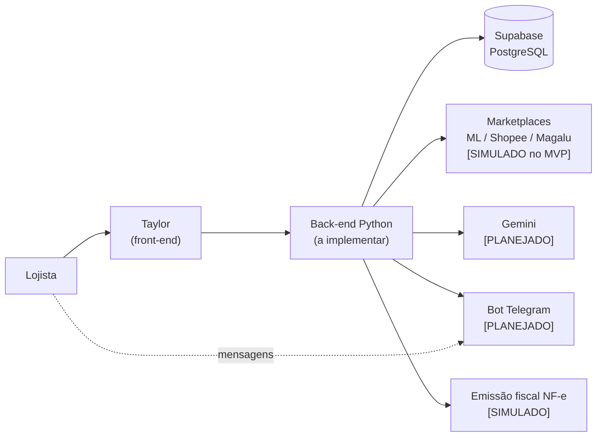

# Gestão de Marketplace e E-ecommerce

## 1. Objetivo do Software Taylor

O **Taylor** é um software de gestão multicanal de marketplace e e-commerce. Ele centraliza, em um único ambiente, a operação de lojistas que vendem em vários canais digitais: **produtos, estoque, pedidos, vendas, canais de venda e documentos fiscais**, com apoio de um **assistente de IA** (texto e voz) e de um **bot no Telegram**.

Frase-síntese do projeto (resumo do projeto):
> Centralizar a operação de e-commerce e transformar dados espalhados entre diferentes canais em uma experiência única de gestão.

## 2. Problema (dor) que resolve

Dor 2 do hackathon — *Gestão de Marketplace e E-commerce*. Principais problemas levantados:

- retrabalho manual;
- cadastros descentralizados;
- divergência de estoque entre canais;
- pedidos espalhados em vários marketplaces;
- atualizações repetitivas de preços e produtos;
- falta de visão centralizada da operação;
- maior risco de erros e inconsistências.

## 3. Público-alvo

Pequenos e médios varejistas que vendem em mais de um canal digital (Mercado Livre, Shopee, Magalu).

Usuários dentro da empresa (representados na tela **Configurações › Equipe**): administrador(a), operação, financeiro e expedição. As permissões de cada papel são **Pendente de definição**.

## 4. Funcionamento geral

Fluxo resumido (baseado no fluxograma do MVP — [diagramas/fluxograma-mvp.png](diagramas/fluxograma-mvp.png)):

1. O lojista acessa o Taylor e faz **login ou cadastro**, informando **CNPJ e dados da empresa**.
2. O lojista **conecta os marketplaces**. O back-end solicita autorização (OAuth), recebe o `access_token` e salva a integração. **No MVP essa conexão é simulada.**
3. O back-end **consulta produtos, pedidos e estoque** dos canais e os armazena de forma centralizada no banco.
4. O front-end exibe o **dashboard** e as telas de produtos, pedidos, estoque, notas fiscais, marketplaces, integrações e relatórios com os dados unificados.
5. O lojista pode **gerenciar catálogo e estoque**; o Taylor sincroniza o estoque central com os canais.
6. O lojista pode conversar com o **assistente de IA** (no sistema, por texto ou voz, ou pelo Telegram). A IA (Gemini) identifica a intenção, o back-end consulta os dados ou executa a ação e gera a resposta.
7. Alertas (estoque, pedidos, NF-e, integrações) são exibidos em **Notificações** e podem ser enviados ao **Telegram**, e-mail ou push.

## 5. Escopo do MVP

Funcionalidades do MVP listadas no resumo do projeto, cruzadas com o que existe no front-end:

| # | Funcionalidade do MVP (resumo do projeto) | Situação no front-end | Classificação |
|---|---|---|---|
| 1 | Dashboard com visão geral da operação | Tela **Início** completa, com dados de exemplo | [SIMULADO] |
| 2 | Gestão de produtos, preços, SKU, estoque atual e estoque mínimo | Listagem de produtos e tela de estoque; botão "Novo produto" sem formulário | [SIMULADO] / [VISUAL] |
| 3 | Controle e alertas de produtos com estoque baixo | Alertas no dashboard, indicadores e status na tela Estoque | [SIMULADO] |
| 4 | Pedidos e vendas de diferentes canais simulados | Tela **Pedidos** e gráficos de vendas | [SIMULADO] |
| 5 | Simulação da sincronização de estoque entre marketplaces | Botão "Sincronizar agora" (animação local), colunas de estoque por canal, divergências | [SIMULADO] |
| 6 | Assistente com IA utilizando Gemini | Painel de chat com respostas fixas | [SIMULADO] (Gemini [PLANEJADO]) |
| 7 | Interação com o assistente por texto e voz, com resposta visual e sonora | Somente texto; **não há interface de voz** | Texto [SIMULADO] / Voz [PLANEJADO] |
| 8 | Bot no Telegram para consultas sobre a operação | Links para `t.me/taylor_assistente_bot`; nenhum bot implementado | [PLANEJADO] |
| 9 | Simulação do fluxo de emissão de NF-e e documentos fiscais | Tela **Notas fiscais** completa com dados de exemplo | [SIMULADO] |

(Implementação e prioridade **Pendente de definição**):

- Configurações de **Plano e cobrança** (Plano Pro, limites de uso, forma de pagamento, faturas);
- **Equipe** (convite de usuários, papéis) e **Segurança** (verificação em duas etapas, encerramento de sessões);
- **Certificado digital** A1;
- **Central de ajuda** (FAQ, status dos serviços);
- **Busca global** na barra superior.

## 6. Tecnologias

| Área | Planejado (resumo do projeto) | Encontrado no repositório |
|---|---|---|
| Front-end | React + Vite | HTML + CSS + JavaScript puro (divergência — ver [pendencias.md](pendencias.md)) |
| Back-end | Python | Não existe; comentário no front cita FastAPI |
| Banco de dados | Supabase | Não existe |
| IA | Gemini API | Não existe; respostas fixas no front |
| Bot | Telegram | Somente link externo |
| Interface do assistente | Texto + voz | Somente texto |

# Taylor (HTML + CSS + JavaScript)

Como abrir: dê dois cliques em `index.html`. Não precisa instalar nada.
(Opcional) servidor local: `npx serve .` ou a extensão Live Server do VS Code.

## Arquivos
- `index.html`  -> página base (só carrega o CSS e o JS).
- `style.css`   -> todas as cores, tamanhos e o layout responsivo.
- `javascript.js` -> telas, dados de exemplo, ações e chat.
- `assets/logo.png` -> logo (troque o arquivo para mudar a logo).

## O que editar
- Cores: variáveis `:root` no começo do `style.css` (tema claro em `.app-shell.light`).
- Nome da marca, logo e conexão com backend: bloco `CONFIG` no início do `javascript.js`.
- Números e textos de exemplo: seção "DADOS DE EXEMPLO" do `javascript.js`.
- Backend: mude `CONFIG.useApi` para `true` e ajuste `CONFIG.apiBase`.
  Cada função do objeto `api` chama um endpoint (ex.: `/dashboard/stats?period=Hoje`)
  e, se falhar, volta para os dados de exemplo.
- Login de teste: qualquer e-mail e senha preenchidos.
