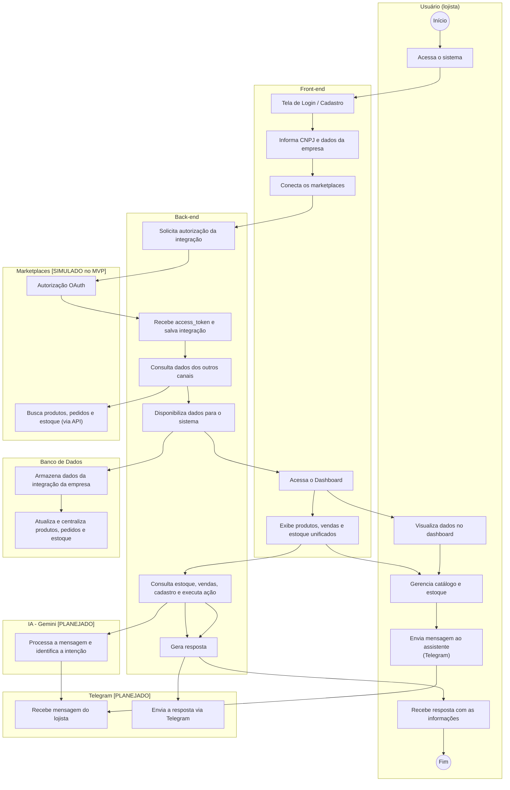
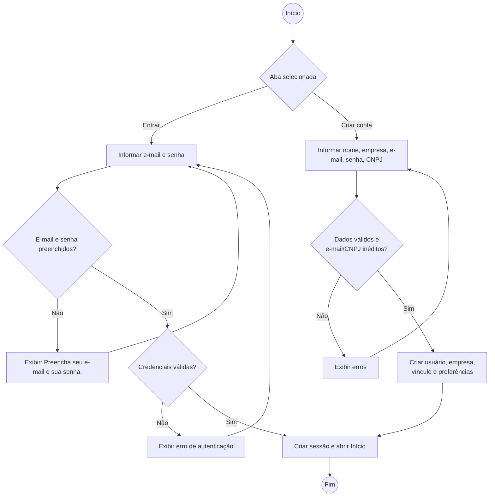
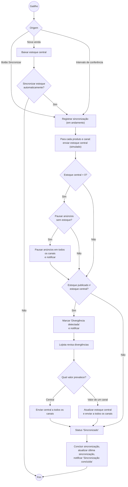
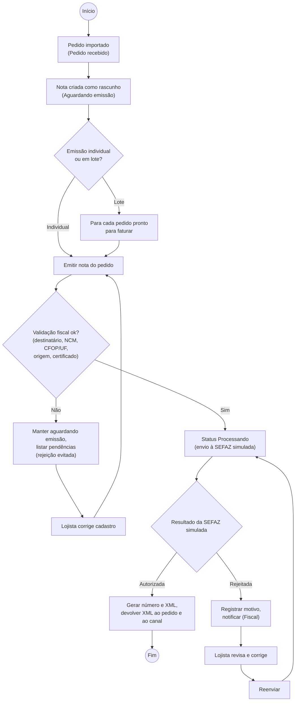
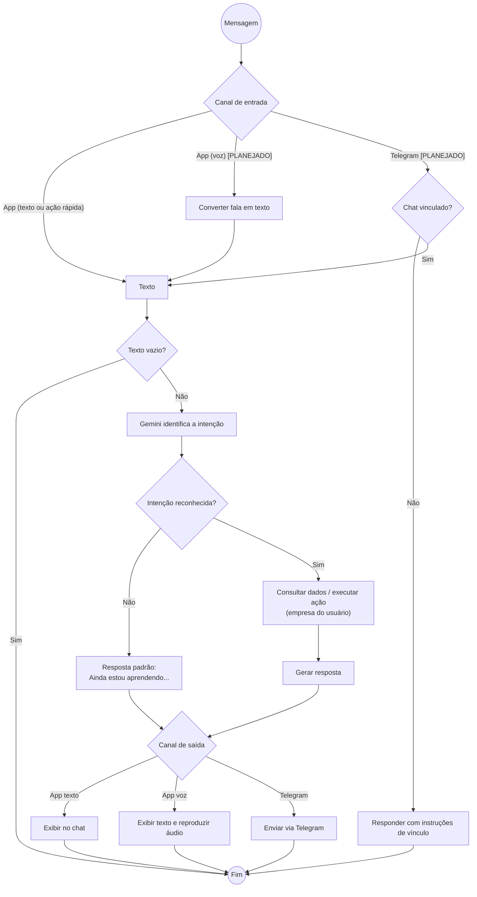
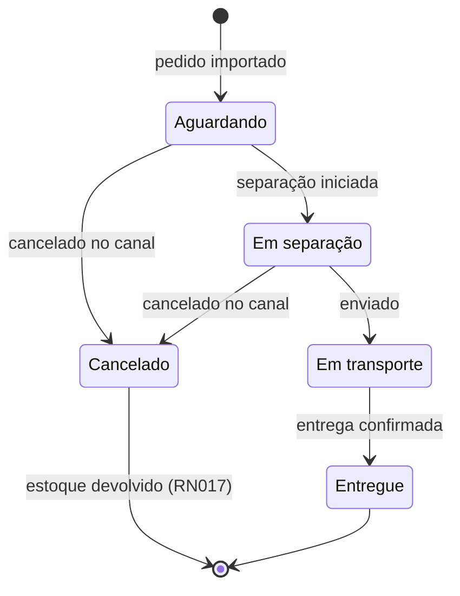
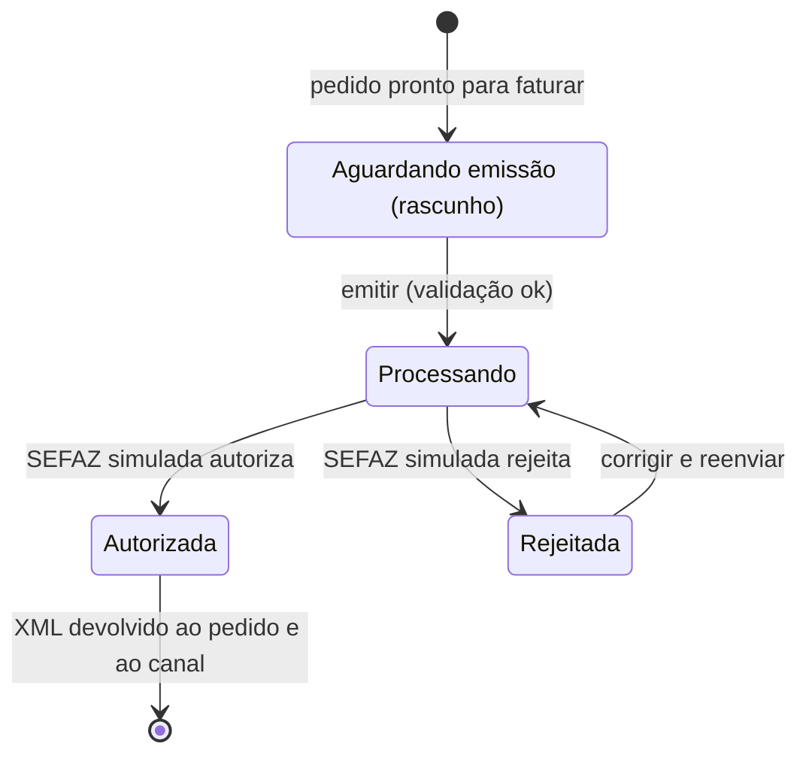
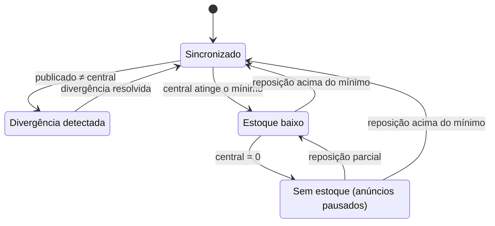

# Diagramas de atividades

Diagramas de atividades em Mermaid (`flowchart`: losangos = decisões) e diagramas de estados (`stateDiagram-v2`) para os ciclos de vida de pedido, NF-e e produto.

## 1. Fluxo geral do MVP

Reproduz o fluxograma oficial ([fluxograma-mvp.png](fluxograma-mvp.png)) em raias.

> Divergência registrada: no fluxograma original o passo do usuário é "Envia mensagem no **WhatsApp**", mas a seta vai para a raia **Telegram**. Aqui foi representado como Telegram (ver [../pendencias.md](../pendencias.md)).

## 2. Acesso ao sistema (login e cadastro)

## 3. Sincronização de estoque e tratamento de divergências

## 4. Emissão de NF-e simulada

## 5. Processamento de mensagem do assistente (texto, voz e Telegram)

## 6. Estados do pedido

Status confirmados pelo front. **As transições são propostas** (o front não mostra mudança de status) — Pendente de definição.

## 7. Estados da NF-e (simulada)

## 8. Status de estoque de um produto

> Prioridade quando duas condições ocorrem ao mesmo tempo (ex.: divergência e estoque baixo) e reativação de anúncios na reposição: Pendente de definição.
