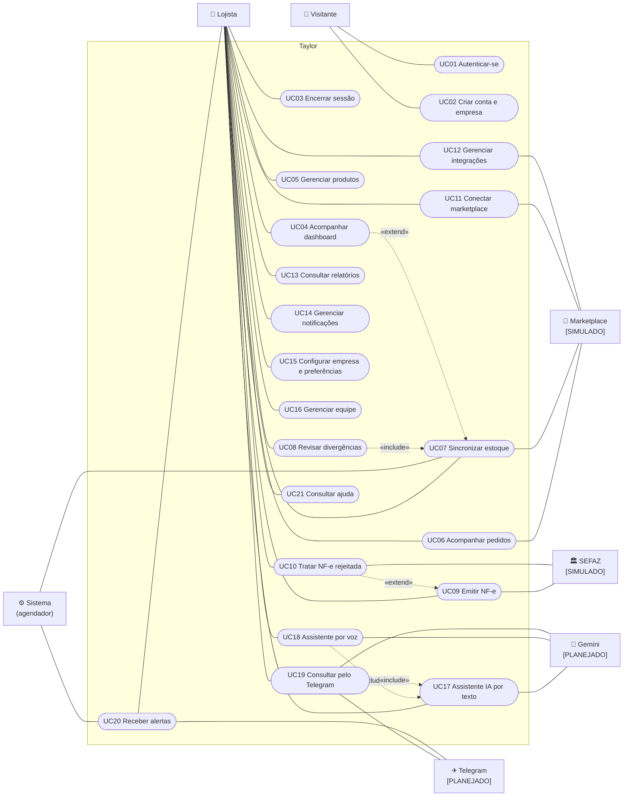

# Diagrama de casos de uso

O Mermaid não possui diagrama de casos de uso UML nativo. A notação abaixo usa `flowchart`: **atores** em retângulos à esquerda/direita, **casos de uso** em elipses (formato estádio) dentro da fronteira do sistema. Linhas sólidas = associação; linhas tracejadas `«include»` / `«extend»` = relações UML.

Especificação textual: [../casos-de-uso.md](../casos-de-uso.md).

## Visão geral

## Casos de uso por classificação

```mermaid
flowchart TB
    subgraph R["[REAL] local / [SIMULADO] no front atual"]
        direction LR
        a1(["UC01"]) --- a2(["UC02"]) --- a3(["UC03"]) --- a4(["UC04"]) --- a5(["UC05"]) --- a6(["UC06"]) --- a13(["UC13"]) --- a14(["UC14"]) --- a17(["UC17"]) --- a21(["UC21"])
    end
    subgraph SM["[SIMULADO] por decisão do MVP"]
        direction LR
        b7(["UC07"]) --- b8(["UC08"]) --- b9(["UC09"]) --- b10(["UC10"]) --- b11(["UC11"]) --- b12(["UC12"])
    end
    subgraph P["[PLANEJADO] sem tela / sem integração"]
        direction LR
        c18(["UC18 Voz"]) --- c19(["UC19 Telegram"]) --- c20(["UC20 Alertas externos"])
    end
    subgraph VS["[VISUAL] escopo Pendente de definição"]
        direction LR
        d15(["UC15"]) --- d16(["UC16"])
    end
```

