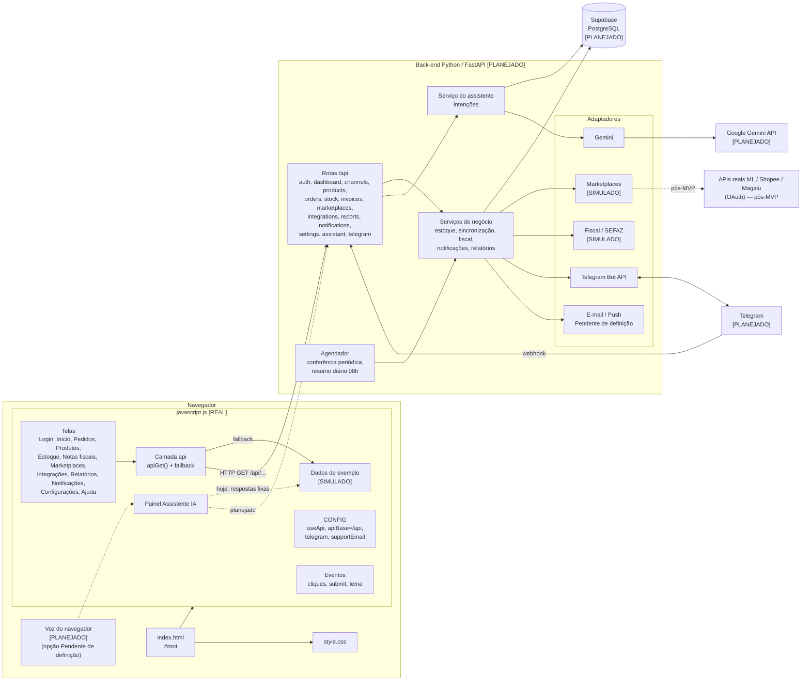
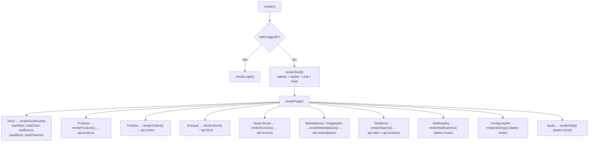

# Diagrama de componentes

## 1. Arquitetura alvo do MVP

Componentes **existentes** (front-end) e **a implementar** (back-end e integrações). Classificação conforme a [legenda](../README.md#legenda-de-classificação).

## 2. Interfaces entre componentes

| De → Para | Interface | Situação |
|---|---|---|
| Telas → camada `api` | Funções `api.stats`, `api.sales`, `api.orderStatuses`, `api.stockAlerts`, `api.channels`, `api.products`, `api.orders`, `api.stock`, `api.invoices`, `api.marketplaces` | [REAL] |
| Camada `api` → back-end | HTTP `GET` em `CONFIG.apiBase + caminho`; fallback para dados de exemplo em caso de erro | [REAL] no front; back-end [PLANEJADO] |
| Telas/eventos → back-end (escrita) | `POST/PUT/PATCH/DELETE` descritos em [../api-backend.md](../api-backend.md#3-contratos-propostos-novos) | [PLANEJADO] — exige ajuste no front |
| Back-end → Supabase | SQL/PostgREST via `supabase-py` ou driver PostgreSQL | [PLANEJADO] |
| Back-end → Gemini | API do Gemini (chave em variável de ambiente) | [PLANEJADO] |
| Telegram ↔ back-end | Webhook de entrada + `sendMessage` | [PLANEJADO] |
| Front → Telegram | Link `https://t.me/taylor_assistente_bot` (nova aba) | [REAL] (somente link) |
| Back-end → marketplaces | Adaptador simulado com interface compatível com OAuth/API real | [SIMULADO] |
| Back-end → SEFAZ | Adaptador fiscal simulado | [SIMULADO] |

## 3. Estrutura interna do front-end atual

Para referência da equipe de back-end (não alterar).

