# Diagramas de sequência

Participantes padrão: **Lojista**, **Front** (`javascript.js`), **API** (back-end Python), **DB** (Supabase/PostgreSQL) e serviços externos. Onde o comportamento atual difere do esperado, há uma nota.

## 1. Login (UC01)

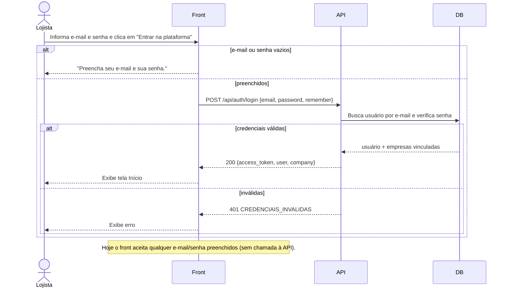

## 2. Criar conta e empresa (UC02)

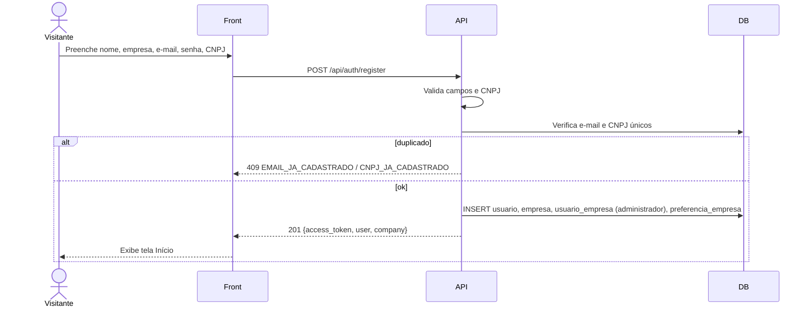

## 3. Carregamento do dashboard (UC04)

As 5 chamadas são disparadas em paralelo por `renderDashboard()` e já existem no front.

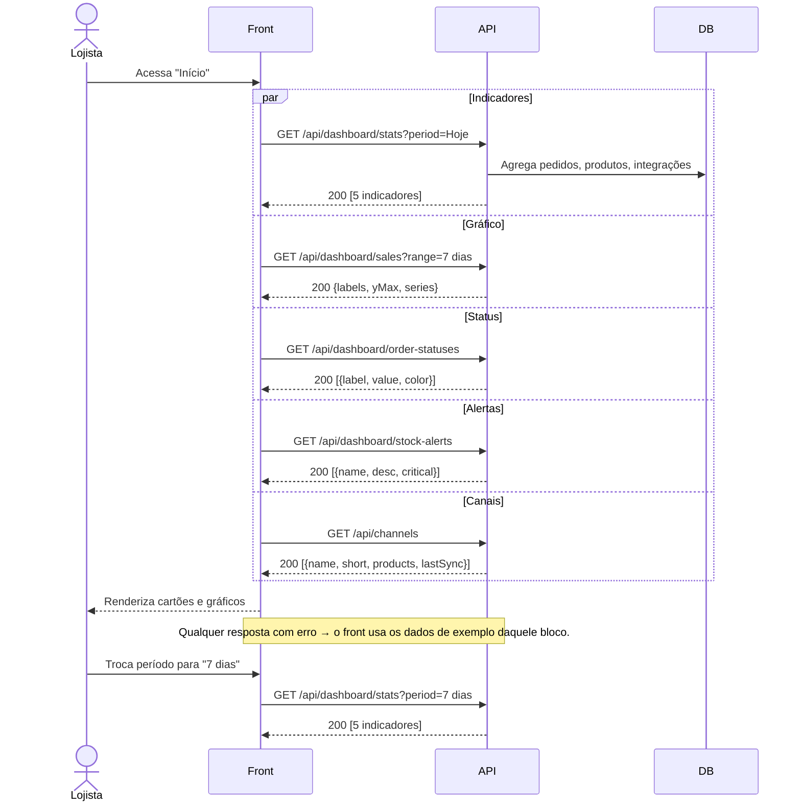

## 4. Conectar marketplace — MVP simulado e OAuth planejado (UC11)

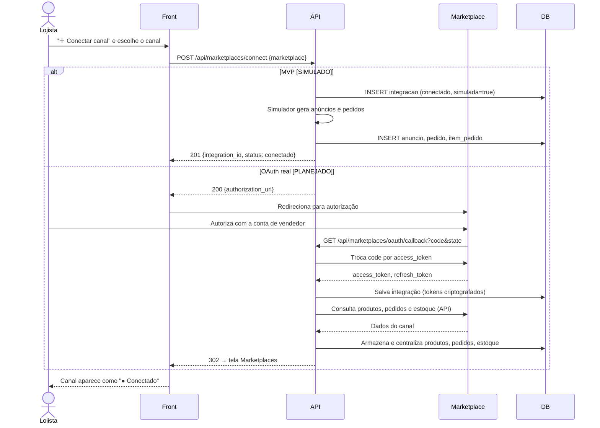

## 5. Venda recebida → baixa e propagação de estoque (RN013, RN016)

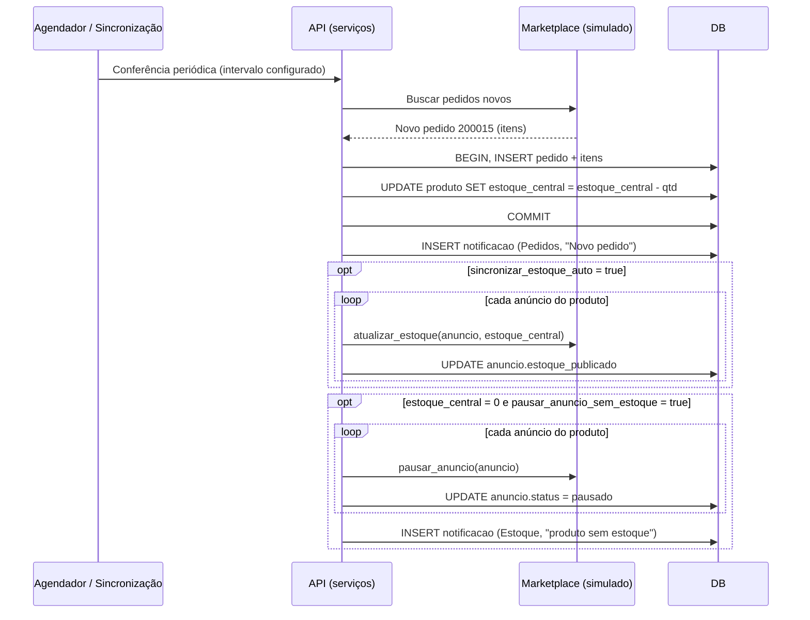

## 6. Sincronizar agora (UC07)

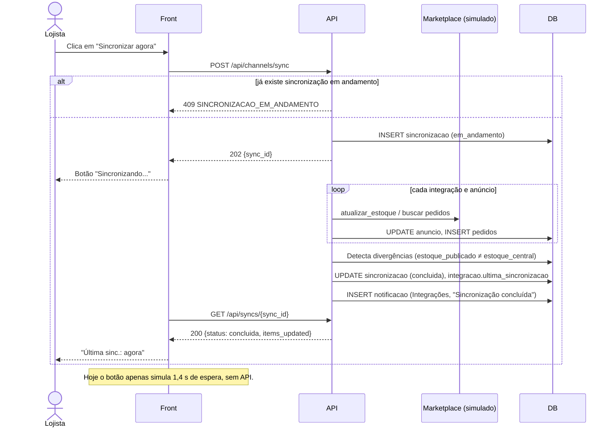

## 7. Revisar divergência de estoque (UC08)

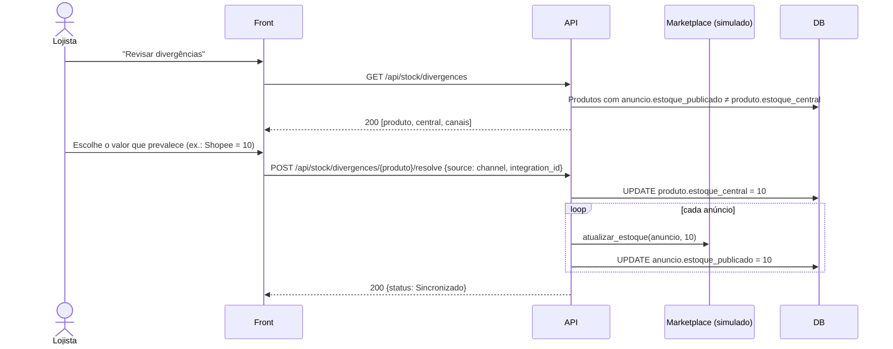

## 8. Emissão de NF-e em lote — simulada (UC09, UC10)

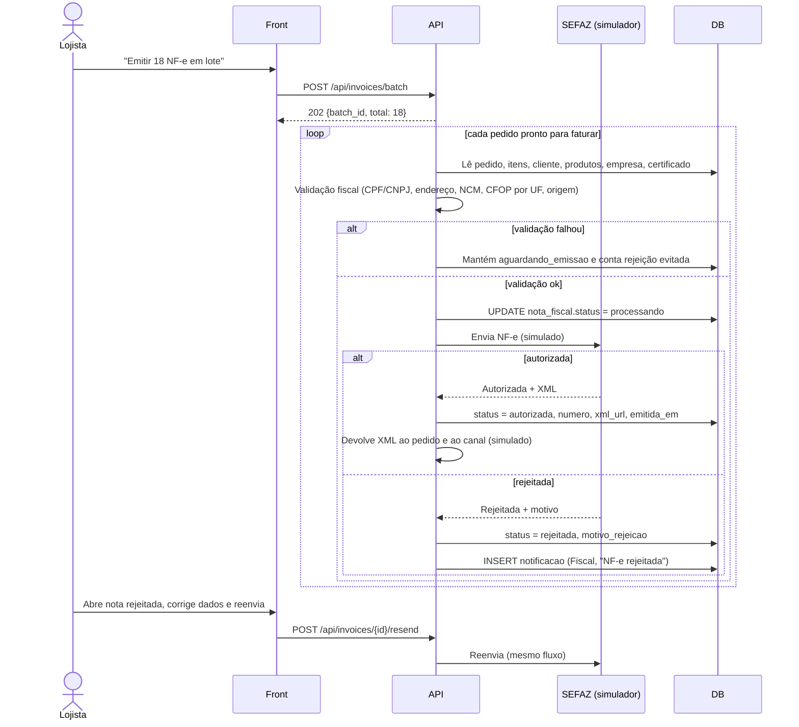

## 9. Assistente de IA por texto (UC17)

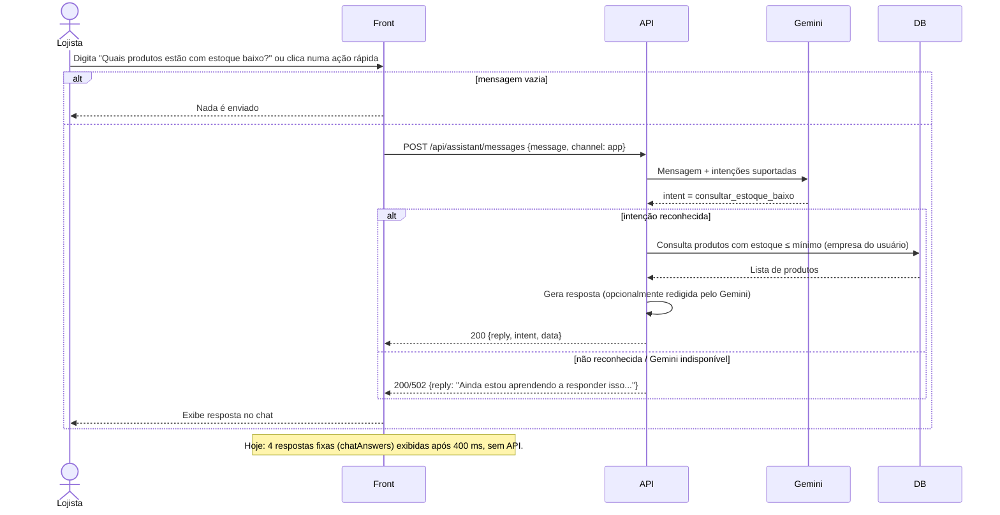

## 10. Assistente por voz — planejado (UC18)

Mostra a opção (a) de [integracoes.md](../integracoes.md#4-reconhecimento-e-interação-por-voz): conversão no navegador. A escolha é **Pendente de definição**.

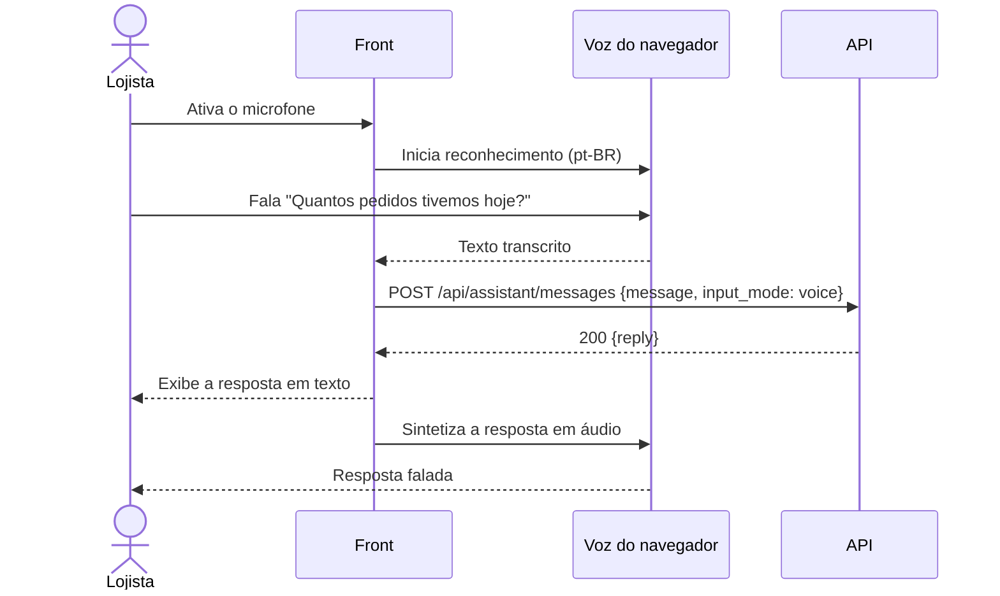

## 11. Consulta pelo Telegram — planejado (UC19)

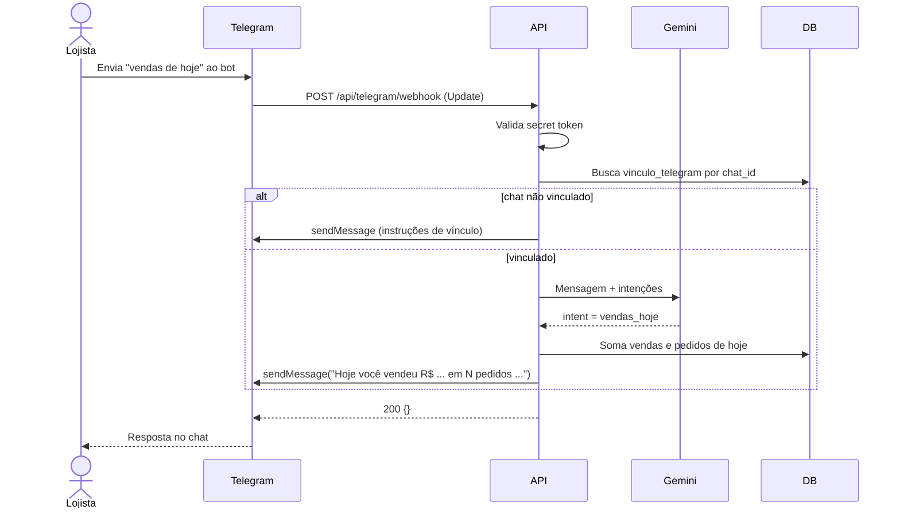

## 12. Envio de alerta (UC20)

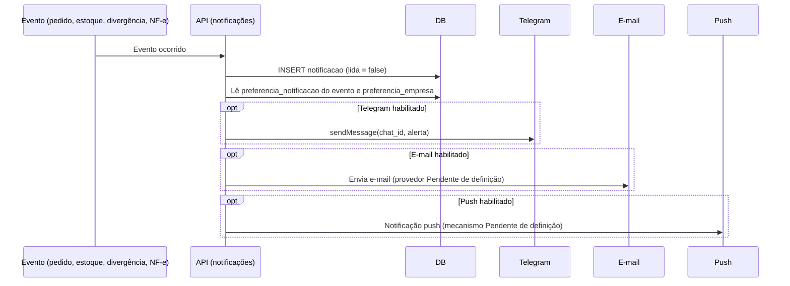
