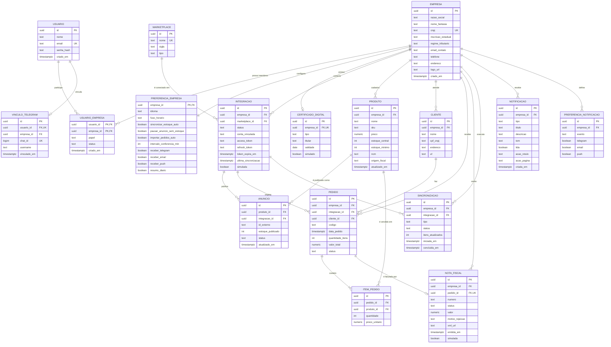

# Modelo de dados

> **Atenção — DER não encontrado.** A tarefa pede o DER como referência principal, mas nenhum DER foi localizado no repositório `isaadsl/Hackathonicos` nem nos anexos (há apenas o fluxograma e o resumo do projeto). O modelo abaixo é uma **proposta derivada** das telas do front-end, do fluxograma (lane "Banco de Dados": *armazena dados da integração da empresa* e *atualiza e centraliza produtos, pedidos e estoque*) e do resumo do projeto. **Validar com a equipe antes de criar as tabelas** — item registrado em [pendencias.md](pendencias.md).

Banco previsto: **Supabase (PostgreSQL)**. Convenções propostas:

- nomes de tabelas e colunas em `snake_case`, no singular;
- PK `id` do tipo `uuid` (padrão do Supabase, `gen_random_uuid()`);
- `criado_em` / `atualizado_em` do tipo `timestamptz`;
- valores monetários em `numeric(12,2)` (o front exibe em R$ com 2 casas);
- enums implementados como `text` + `CHECK` (ou tipo `enum` do PostgreSQL);
- **toda tabela operacional possui `empresa_id`** para isolar os dados de cada CNPJ (multiempresa — RN003).

## 1. Diagrama entidade-relacionamento

## 2. Entidades

Legenda das colunas: **PK** chave primária · **FK** chave estrangeira · **UK** único · **NN** obrigatório.

### 2.1 `usuario`
Pessoa que acessa o Taylor. Telas: Login, Configurações › Equipe.

| Atributo | Tipo | Restrições | Origem no front |
|---|---|---|---|
| id | uuid | PK | — |
| nome | text | NN | "Seu nome" (Criar conta); nome na Equipe |
| email | text | NN, UK | "E-mail" (Login) |
| senha_hash | text | NN (se autenticação própria) | "Senha". Se usar Supabase Auth, a senha fica no Auth e esta coluna não existe — Pendente de definição |
| criado_em | timestamptz | NN, default `now()` | — |

### 2.2 `empresa`
CNPJ operado no Taylor. Telas: Criar conta, Configurações › Empresa, sidebar (nome da empresa).

| Atributo | Tipo | Restrições | Origem no front |
|---|---|---|---|
| id | uuid | PK | — |
| razao_social | text | Pendente de definição (NN) | "Razão social" |
| nome_fantasia | text | NN | "Empresa" (Criar conta), "Nome fantasia" |
| cnpj | text | NN, UK, 14 dígitos (armazenar sem máscara) | "CNPJ" |
| inscricao_estadual | text | — | "Inscrição estadual" |
| regime_tributario | text | CHECK ∈ {`simples_nacional`, `lucro_presumido`, `lucro_real`} | "Regime tributário" |
| email_contato | text | — | "E-mail de contato" |
| telefone | text | — | "Telefone" |
| endereco | text | — | "Endereço" (campo único). Estrutura detalhada: Pendente de definição |
| logo_url | text | — | "Alterar logo" |
| criado_em | timestamptz | NN | "cliente desde mar/2025" |

### 2.3 `usuario_empresa`
Associação N:N entre usuário e empresa (equipe e multi-CNPJ). Tela: Configurações › Equipe.

| Atributo | Tipo | Restrições | Origem no front |
|---|---|---|---|
| usuario_id | uuid | PK, FK → usuario.id | — |
| empresa_id | uuid | PK, FK → empresa.id | — |
| papel | text | CHECK ∈ {`administrador`, `operacao`, `financeiro`, `expedicao`} | "Administradora", "Operação", "Financeiro", "Expedição" |
| status | text | CHECK ∈ {`ativo`, `convite_pendente`} | "Ativo", "Convite pendente" |
| criado_em | timestamptz | NN | — |

### 2.4 `preferencia_empresa`
Preferências operacionais (1:1 com empresa). Telas: Configurações › Preferências; Notificações › "Onde receber alertas".

| Atributo | Tipo | Restrições | Origem no front |
|---|---|---|---|
| empresa_id | uuid | PK, FK → empresa.id | — |
| idioma | text | CHECK ∈ {`pt-BR`, `en`, `es`}; default `pt-BR` | "Idioma" |
| fuso_horario | text | CHECK ∈ {`America/Sao_Paulo`, `America/Manaus`, `America/Noronha`} | "Fuso horário" |
| sincronizar_estoque_auto | boolean | default `true` | RN013 |
| pausar_anuncio_sem_estoque | boolean | default `true` | RN016 |
| importar_pedidos_auto | boolean | default `true` | RN021 |
| intervalo_conferencia_min | int | CHECK ∈ {5, 15, 30, 60} | RN022 |
| receber_telegram / receber_email / receber_push / resumo_diario | boolean | defaults `true`, `true`, `false`, `true` | "Onde receber alertas" |

> O tema claro/escuro é hoje apenas local. Se deve ser persistido e se é por usuário: Pendente de definição.

### 2.5 `certificado_digital`
Tela: Configurações › Empresa, Saúde fiscal. **[SIMULADO]**.

| Atributo | Tipo | Restrições |
|---|---|---|
| id | uuid | PK |
| empresa_id | uuid | FK → empresa.id, UK (1 certificado ativo por empresa) |
| tipo | text | CHECK ∈ {`A1`} |
| titular | text | — |
| validade | date | NN |
| simulado | boolean | default `true` no MVP |

### 2.6 `marketplace`
Catálogo de canais/serviços (dados de referência). Telas: Dashboard, Marketplaces, Integrações.

| Atributo | Tipo | Restrições | Valores iniciais |
|---|---|---|---|
| id | uuid | PK | — |
| nome | text | NN, UK | Mercado Livre, Shopee, Magalu, Telegram |
| sigla | text | NN | ML, S, M, — |
| tipo | text | CHECK ∈ {`marketplace`, `atendimento`} | Telegram = `atendimento` (rótulo exibido em Integrações) |

### 2.7 `integracao`
Conexão de uma empresa com um marketplace (ou com o Telegram). Fluxograma: "Recebe access_token e salva integração" / "Armazena dados da integração da empresa".

| Atributo | Tipo | Restrições | Origem |
|---|---|---|---|
| id | uuid | PK | — |
| empresa_id | uuid | NN, FK → empresa.id | — |
| marketplace_id | uuid | NN, FK → marketplace.id | — |
| status | text | CHECK ∈ {`conectado`, `desconectado`} (outros estados: Pendente de definição) | "● Conectado" |
| conta_vinculada | text | — | "Loja Beta Oficial", "@lojabeta_bot" |
| access_token / refresh_token | text | Armazenar criptografado; nulos no MVP simulado | FLX |
| token_expira_em | timestamptz | — | — |
| ultima_sincronizacao | timestamptz | — | "Última sinc.", "Última sincronização há…" |
| simulada | boolean | default `true` no MVP | RN019 |

Restrição: **UK (`empresa_id`, `marketplace_id`)** — um canal conectado por empresa (Pendente de definição se uma empresa pode conectar duas contas do mesmo marketplace).

### 2.8 `produto`
Catálogo central. Telas: Produtos, Estoque, Dashboard (alertas), Relatórios.

| Atributo | Tipo | Restrições | Origem no front |
|---|---|---|---|
| id | uuid | PK | — |
| empresa_id | uuid | NN, FK → empresa.id | — |
| nome | text | NN | "Produto" |
| sku | text | NN; **UK (`empresa_id`, `sku`)** | "SKU" |
| preco | numeric(12,2) | NN, `>= 0` | "Preço" |
| estoque_central | int | NN, `>= 0` | "Estoque", "Estoque central" |
| estoque_minimo | int | NN, `>= 0` | "Estoque mínimo" |
| ncm | text | — | Saúde fiscal: "NCM preenchido em 308 produtos" |
| origem_fiscal | text | — | Saúde fiscal: "4 produtos sem origem fiscal" |
| atualizado_em | timestamptz | NN | "Atualização" |

**Status derivado (não armazenar):** `sem_estoque` se `estoque_central = 0`; `estoque_baixo` se `estoque_central` atinge `estoque_minimo` (RN012 — comparação Pendente de definição); senão `ativo`.

### 2.9 `anuncio`
Publicação de um produto em um canal; guarda a quantidade publicada para detectar divergências. Telas: Estoque (colunas por canal), Produtos (coluna "Canais"), Marketplaces ("Produtos publicados").

| Atributo | Tipo | Restrições | Origem |
|---|---|---|---|
| id | uuid | PK | — |
| produto_id | uuid | NN, FK → produto.id | — |
| integracao_id | uuid | NN, FK → integracao.id | — |
| id_externo | text | — | ID do anúncio no marketplace (nulo quando simulado) |
| estoque_publicado | int | NN, `>= 0` | Colunas Mercado Livre / Shopee / Magalu |
| status | text | CHECK ∈ {`ativo`, `pausado`} | RN016 |
| atualizado_em | timestamptz | NN | — |

Restrição: **UK (`produto_id`, `integracao_id`)**.
**Divergência** (RN015): existe quando `anuncio.estoque_publicado <> produto.estoque_central`.

### 2.10 `cliente`
Comprador do pedido e destinatário da NF-e. Telas: Pedidos ("Cliente"), Notas fiscais ("Cliente"), Guardião de rejeições ("CPF/CNPJ e endereço validados").

| Atributo | Tipo | Restrições |
|---|---|---|
| id | uuid | PK |
| empresa_id | uuid | NN, FK → empresa.id |
| nome | text | NN |
| cpf_cnpj | text | Necessário para NF-e |
| endereco | text | Necessário para NF-e |
| uf | char(2) | Necessário para a regra de CFOP por UF (RN026) |

### 2.11 `pedido`
Pedido recebido de um marketplace. Telas: Pedidos, Dashboard, Notas fiscais, Relatórios.

| Atributo | Tipo | Restrições | Origem no front |
|---|---|---|---|
| id | uuid | PK | — |
| empresa_id | uuid | NN, FK → empresa.id | — |
| integracao_id | uuid | NN, FK → integracao.id | "Canal" |
| cliente_id | uuid | FK → cliente.id | "Cliente" |
| codigo | text | NN; **UK (`empresa_id`, `codigo`)** | "#200014" |
| data_pedido | timestamptz | NN | "Data" |
| quantidade_itens | int | NN, `>= 1` (pode ser derivado de `item_pedido`) | "Itens" |
| valor_total | numeric(12,2) | NN, `>= 0` | "Valor" |
| status | text | CHECK ∈ {`aguardando`, `em_separacao`, `em_transporte`, `entregue`, `cancelado`} | RN007 |

### 2.12 `item_pedido`
Itens do pedido; permite baixar estoque por produto (RN013, RN017) e calcular "Produtos mais vendidos" e "Produtos vendidos" (Relatórios).

| Atributo | Tipo | Restrições |
|---|---|---|
| id | uuid | PK |
| pedido_id | uuid | NN, FK → pedido.id (ON DELETE CASCADE) |
| produto_id | uuid | NN, FK → produto.id |
| quantidade | int | NN, `>= 1` |
| preco_unitario | numeric(12,2) | NN, `>= 0` |

### 2.13 `nota_fiscal`
NF-e **[SIMULADO]**. Tela: Notas fiscais; notificações do tipo Fiscal.

| Atributo | Tipo | Restrições | Origem no front |
|---|---|---|---|
| id | uuid | PK | — |
| empresa_id | uuid | NN, FK → empresa.id | — |
| pedido_id | uuid | NN, FK → pedido.id, UK | "Pedido" (RN025) |
| numero | text | Nulo enquanto rascunho | "NF-e 004821" / "Rascunho" |
| status | text | CHECK ∈ {`aguardando_emissao`, `processando`, `autorizada`, `rejeitada`} | RN025 |
| valor | numeric(12,2) | NN | "Valor" |
| motivo_rejeicao | text | Preenchido quando `rejeitada` | "SEFAZ: CFOP incompatível com a UF de destino." |
| xml_url | text | Preenchido quando `autorizada` | RN028 |
| emitida_em | timestamptz | — | "Emissão" |
| simulada | boolean | default `true` | RN024 |

> `pedido_id` UK assume uma NF-e por pedido. Reemissão após rejeição reaproveita o mesmo registro. Histórico de tentativas: Pendente de definição.

### 2.14 `sincronizacao`
Registro de cada sincronização (manual ou automática). Telas: Dashboard ("Sincronizar agora"), Estoque, Marketplaces; notificação "Sincronização concluída — 312 produtos atualizados em 3 marketplaces sem erros".

| Atributo | Tipo | Restrições |
|---|---|---|
| id | uuid | PK |
| empresa_id | uuid | NN, FK → empresa.id |
| integracao_id | uuid | FK → integracao.id (nulo = todos os canais) |
| tipo | text | CHECK ∈ {`completa`, `estoque`, `pedidos`, `produtos`} |
| status | text | CHECK ∈ {`em_andamento`, `concluida`, `erro`} |
| itens_atualizados | int | — |
| iniciada_em / concluida_em | timestamptz | — |

### 2.15 `notificacao`
Tela: Notificações; contador na sidebar/topbar.

| Atributo | Tipo | Restrições | Origem no front |
|---|---|---|---|
| id | uuid | PK | `id` |
| empresa_id | uuid | NN, FK → empresa.id | — |
| tipo | text | CHECK ∈ {`pedidos`, `estoque`, `fiscal`, `integracoes`} | `type` (RN030) |
| titulo | text | NN | `title` |
| descricao | text | — | `desc` |
| tom | text | CHECK ∈ {`red`, `blue`, `yellow`, `green`, `purple`, `telegram`} | `tone` (cor do ícone) |
| lida | boolean | NN, default `false` | `unread` (invertido) |
| acao_rotulo | text | — | `action[0]` ("Ver estoque") |
| acao_pagina | text | — | `action[1]` ("Estoque") |
| criada_em | timestamptz | NN | `time` ("Há 5 min" é calculado no retorno) |

> Leitura por empresa ou por usuário: Pendente de definição (o modelo proposto é por empresa, como no front).

### 2.16 `preferencia_notificacao`
Matriz Evento × Canal. Tela: Configurações › Notificações.

| Atributo | Tipo | Restrições |
|---|---|---|
| id | uuid | PK |
| empresa_id | uuid | NN, FK → empresa.id |
| evento | text | CHECK ∈ {`novo_pedido`, `estoque_baixo`, `divergencia_estoque`, `nfe_rejeitada`, `resumo_diario`}; **UK (`empresa_id`, `evento`)** |
| telegram / email / push | boolean | Defaults em RN031 |

### 2.17 `vinculo_telegram`
Liga um usuário a um chat do Telegram para consultas e alertas. **[PLANEJADO]**. Telas: Configurações › Notificações (card Telegram), Integrações.

| Atributo | Tipo | Restrições |
|---|---|---|
| id | uuid | PK |
| usuario_id | uuid | NN, FK → usuario.id, UK |
| empresa_id | uuid | NN, FK → empresa.id |
| chat_id | bigint | NN, UK (identificador do chat no Telegram) |
| username | text | "@lojabeta_bot" exibido no front |
| vinculado_em | timestamptz | "Alertas ativos desde 12/09/2026" |

> Processo de vínculo (código de pareamento, deep link `/start <token>` etc.): Pendente de definição.

## 3. Relacionamentos e cardinalidades

| Relacionamento | Cardinalidade | Observação |
|---|---|---|
| usuario — empresa (via `usuario_empresa`) | N:N | Equipe e multi-CNPJ (RN003) |
| empresa — preferencia_empresa | 1:1 | Criada junto com a empresa |
| empresa — certificado_digital | 1:0..1 | [SIMULADO] |
| empresa — integracao | 1:N | |
| marketplace — integracao | 1:N | |
| empresa — produto | 1:N | |
| produto — anuncio | 1:N | Um anúncio por canal conectado |
| integracao — anuncio | 1:N | |
| empresa — cliente | 1:N | |
| cliente — pedido | 1:N | |
| integracao — pedido | 1:N | Canal de origem (RN009) |
| pedido — item_pedido | 1:1..N | |
| produto — item_pedido | 1:N | |
| pedido — nota_fiscal | 1:0..1 | RN025 |
| empresa / integracao — sincronizacao | 1:N | |
| empresa — notificacao | 1:N | |
| empresa — preferencia_notificacao | 1:N (5 eventos) | |
| usuario — vinculo_telegram | 1:0..1 | [PLANEJADO] |

## 4. Restrições e regras no banco

| Restrição | Implementação sugerida | Regra |
|---|---|---|
| E-mail único | `UNIQUE (usuario.email)` | RF002 |
| CNPJ único | `UNIQUE (empresa.cnpj)` | RF002 |
| SKU único por empresa | `UNIQUE (produto.empresa_id, produto.sku)` | RF011 |
| Estoque e preço não negativos | `CHECK (estoque_central >= 0)`, `CHECK (preco >= 0)` | RN010 |
| Um anúncio por produto/canal | `UNIQUE (anuncio.produto_id, anuncio.integracao_id)` | RN018 |
| Uma NF-e por pedido | `UNIQUE (nota_fiscal.pedido_id)` | RN025 |
| NF-e rejeitada tem motivo | `CHECK (status <> 'rejeitada' OR motivo_rejeicao IS NOT NULL)` | RN027 |
| Isolamento por empresa | Filtro obrigatório por `empresa_id` em todas as consultas; se usar Supabase, **Row Level Security** com base em `usuario_empresa` | RN003 |
| Baixa/estorno de estoque | Transação no back-end: inserir pedido + itens e decrementar `estoque_central`; ao cancelar, incrementar | RN013, RN017 |

## 5. Vínculo entre entidades e funcionalidades do front-end

| Tela / componente | Entidades |
|---|---|
| Login / Criar conta | usuario, empresa, usuario_empresa, preferencia_empresa |
| Início › indicadores | pedido, item_pedido, produto, integracao |
| Início › Vendas por canal | pedido, integracao, marketplace |
| Início › Pedidos por status | pedido |
| Início › Alertas de estoque | produto |
| Início › Canais conectados | integracao, marketplace, anuncio, sincronizacao |
| Produtos | produto, anuncio, integracao |
| Pedidos | pedido, cliente, integracao, marketplace, item_pedido |
| Estoque | produto, anuncio, integracao, sincronizacao |
| Notas fiscais | nota_fiscal, pedido, cliente, produto (NCM/origem), certificado_digital, empresa |
| Marketplaces | integracao, marketplace, anuncio, pedido |
| Integrações | integracao, marketplace, vinculo_telegram |
| Relatórios | pedido, item_pedido, produto, integracao |
| Notificações | notificacao, preferencia_empresa, vinculo_telegram |
| Configurações › Empresa | empresa, certificado_digital |
| Configurações › Preferências | preferencia_empresa |
| Configurações › Notificações | preferencia_notificacao, vinculo_telegram |
| Configurações › Equipe | usuario, usuario_empresa |
| Configurações › Plano | *sem entidade proposta* — fora do escopo do MVP (Pendente de definição) |
| Assistente IA / Telegram | leitura de produto, pedido, integracao; vinculo_telegram. Persistência do histórico de conversa: Pendente de definição (o front não mantém histórico) |
| Ajuda | *sem entidade* — FAQ e status dos serviços podem ser estáticos (Pendente de definição) |
