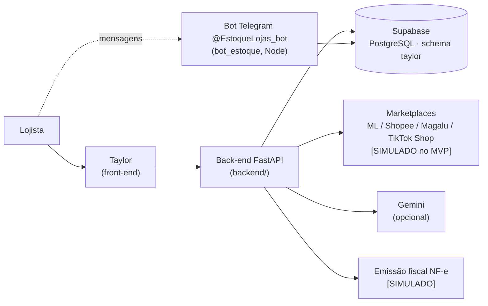

# Visão geral

## 1. Objetivo do Taylor

O **Taylor** é um software de gestão multicanal de marketplace e e-commerce. Ele centraliza, em um único ambiente, a operação de lojistas que vendem em vários canais digitais: **produtos, estoque, pedidos, vendas, canais de venda e documentos fiscais**, com apoio de um **assistente de IA** (texto e voz) e de um **bot no Telegram**.

Frase-síntese do projeto (resumo do projeto):
> Centralizar a operação de e-commerce e transformar dados espalhados entre diferentes canais em uma experiência única de gestão.

## 2. Problema (dor) que resolve

Dor 2 do hackathon — *Gestão de Marketplace e E-commerce*. Principais problemas levantados:

- retrabalho manual;
- cadastros descentralizados;
- divergência de estoque entre canais;
- pedidos espalhados em vários marketplaces;
- atualizações repetitivas de preços e produtos;
- falta de visão centralizada da operação;
- maior risco de erros e inconsistências.

## 3. Público-alvo

Pequenos e médios varejistas que vendem em mais de um canal digital (Mercado Livre, Shopee, Magalu).

Usuários dentro da empresa (representados na tela **Configurações › Equipe**): administrador(a), operação, financeiro e expedição. As permissões de cada papel são **Pendente de definição**.

## 4. Funcionamento geral

O back-end também serve o front-end. O bot do Telegram é um programa à parte que lê e grava nas mesmas
tabelas do banco (schema `taylor`) e busca as mensagens no Telegram por *long polling*.

Fluxo resumido (baseado no fluxograma do MVP — [diagramas/fluxograma-mvp.png](diagramas/fluxograma-mvp.png)):

1. O lojista acessa o Taylor e faz **login ou cadastro**, informando **CNPJ e dados da empresa**.
2. O lojista **conecta os marketplaces**. O back-end solicita autorização (OAuth), recebe o `access_token` e salva a integração. **No MVP essa conexão é simulada.**
3. O back-end **consulta produtos, pedidos e estoque** dos canais e os armazena de forma centralizada no banco.
4. O front-end exibe o **dashboard** e as telas de produtos, pedidos, estoque, notas fiscais, marketplaces, integrações e relatórios com os dados unificados.
5. O lojista pode **gerenciar catálogo e estoque**; o Taylor sincroniza o estoque central com os canais.
6. O lojista pode conversar com o **assistente de IA** no sistema, por texto ou voz. A IA (Gemini, quando há `GEMINI_API_KEY`) identifica a intenção; o back-end consulta os dados e gera a resposta. Sem a chave, a intenção vem de palavras-chave.
7. No **Telegram** (@EstoqueLojas_bot), o lojista entra com o mesmo e-mail e senha do painel e consulta ou atualiza o estoque por comandos (`/estoque`, `/entrada`, `/baixa`, `/novo`...).
8. Alertas (estoque, pedidos, NF-e, integrações) são exibidos em **Notificações**. O bot envia no Telegram os avisos de **novo pedido** e o **resumo** das 9h, 13h e 18h. E-mail e push: [PLANEJADO].

## 5. Escopo do MVP

Funcionalidades do MVP listadas no resumo do projeto, cruzadas com o que existe hoje (front-end + back-end + bot):

| # | Funcionalidade do MVP (resumo do projeto) | Situação atual | Classificação |
|---|---|---|---|
| 1 | Dashboard com visão geral da operação | Tela **Início** com indicadores, gráficos e alertas calculados no back-end a partir do banco | [REAL] |
| 2 | Gestão de produtos, preços, SKU, estoque atual e estoque mínimo | Listagem, novo produto, edição e exclusão gravam no banco | [REAL] |
| 3 | Controle e alertas de produtos com estoque baixo | Status, alertas do dashboard e notificações calculados no back-end | [REAL] |
| 4 | Pedidos e vendas de diferentes canais simulados | Pedidos importados pelo simulador de marketplace; avanço de status e cancelamento gravam no banco | [SIMULADO] (canais) |
| 5 | Simulação da sincronização de estoque entre marketplaces | "Sincronizar agora" envia o estoque central aos canais simulados e detecta divergências | [SIMULADO] |
| 6 | Assistente com IA utilizando Gemini | Chat responde com dados reais; o Gemini identifica a intenção quando há `GEMINI_API_KEY` (sem chave: palavras-chave) | [REAL] |
| 7 | Interação com o assistente por texto e voz, com resposta visual e sonora | Texto e voz (microfone no chat, Web Speech API) com resposta falada | [REAL] |
| 8 | Bot no Telegram para consultas sobre a operação | Bot `@EstoqueLojas_bot` (`bot_estoque/`, long polling): login, estoque, entrada/baixa, novo produto, aviso de novo pedido e resumo periódico | [REAL] |
| 9 | Simulação do fluxo de emissão de NF-e e documentos fiscais | Validação fiscal no back-end e SEFAZ simulada (autoriza ou rejeita) | [SIMULADO] |

Itens presentes no front-end, mas **não citados no escopo do MVP** do resumo do projeto (implementação e prioridade: **Pendente de definição**):

- Configurações de **Plano e cobrança** (Plano Pro, limites de uso, forma de pagamento, faturas);
- **Equipe** (convite de usuários, papéis) e **Segurança** (verificação em duas etapas, encerramento de sessões);
- **Certificado digital** A1;
- **Central de ajuda** (FAQ, status dos serviços);
- **Busca global** na barra superior.

## 6. Tecnologias

| Área | Planejado (resumo do projeto) | Encontrado no repositório |
|---|---|---|
| Front-end | React + Vite | HTML + CSS + JavaScript puro (divergência mantida: o front foi feito sem framework) |
| Back-end | Python | Python + FastAPI (`backend/`), que também serve o front |
| Banco de dados | Supabase | Supabase (PostgreSQL), schema `taylor`, conexão direta pelo Session pooler |
| IA | Gemini API | Gemini (REST, opcional) identifica a intenção; a resposta é montada pelo back-end |
| Bot | Telegram | Node.js + Telegraf (`bot_estoque/`), long polling, mesmas tabelas do schema `taylor` |
| Interface do assistente | Texto + voz | Texto + voz (Web Speech API no navegador) |
